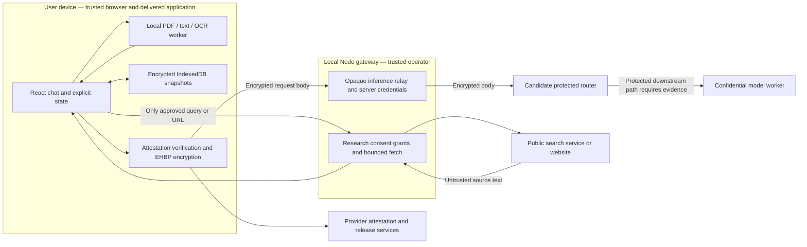

# PrivateAI — architecture and trust boundaries

**Working architecture v0.2 · implementation notes reconciled 7 October 2026**

Current verification status lives in the [readiness checklist](READINESS.md). This
document specifies mechanisms and trust boundaries; dated evidence is not a
substitute for release qualification.

Companion to the [PRD](PRD.md). The browser-to-gateway inference path is implemented and wired into the web app. A synthetic two-turn exchange succeeded on the earlier adapter; current-adapter narrow live compatibility has evidence, while the full protected-processing claim remains unqualified. See the [qualification ledger](provider-qualification.md) and [validation](validation.md).

## 1. Components and flow

Inference responses return through the relay for browser decryption and display. The router/model branch is a candidate design, not a qualified deployment. Browser verification requests go directly to configured attestation services and can reveal the user's network identity. Workers improve responsiveness; they are not confidential-computing boundaries.

| Component | Responsibility and implementation |
| --- | --- |
| Web client | `src/App.tsx` owns conversation lifecycle, selected attachments, status and explicit save/lock behavior. `src/conversation.ts` composes bounded context and invalidates later turns after edits. |
| Extraction | `src/extraction.worker.ts` parses bounded inputs with locally served PDF/OCR assets. Users inspect/correct extraction; no general document fidelity guarantee follows from parser success. |
| Inference | `src/inference.ts` composes maintained Tinfoil verification and EHBP libraries, checks approved host/release/key, encrypts and streams. Compatibility and the complete protection chain require live qualification. |
| Gateway | `server/app.ts` provides loopback sessions, CSRF protection, fixed-destination relay and research grant lifecycle. Provider credentials stay here. |
| Research | `server/research.ts` enforces bounded public retrieval and configured search. No model tool execution is enabled. |
| Local storage | `src/vault.ts` uses WebCrypto and IndexedDB for manually saved encrypted conversation snapshots. |
| Configuration | `shared/contracts.ts` validates typed provider/report contracts; environment settings supply credentials and allowed hosts. One candidate adapter initially, no speculative integration framework. |

One TypeScript application and gateway avoid separate queues, vector databases and microservices. Maintain explicit module boundaries and lockfile-controlled dependencies. Changing providers requires a real adapter and fresh qualification, not simply replacing a URL.

## 2. Data lifecycle

1. The browser reads a selected file and extracts text locally. Raw file content is not deliberately uploaded or persisted by the application. Selected extracted text and provenance enter the conversation.
2. The user chooses context. Complete included messages and selected source text form the request; oversized context is rejected without silent truncation. Each answer retains its source snapshot.
3. Before inference, the client checks the configured qualification artifact and independently verifies provider evidence against approved software and keys. Only the approved encrypted request travels through the fixed relay.
4. For research, the client first previews the exact disclosure locally. After approval, the gateway creates an immutable, session-bound, single-use grant, expiring after five minutes, and executes that request. Returned content remains untrusted.
5. Temporary conversations stay in application memory. Manual save encrypts conversation content, including source snapshots, into browser storage. Locking removes application access to in-memory vault keys and saved views; it is not a forensic memory-erasure guarantee.
6. Deletion removes the stored ciphertext and wrapped conversation key. A random-ID tombstone prevents stale tabs from saving the deleted record again. Vault salt/check metadata and deletion markers remain; browser/OS backups are outside the erasure promise.

Source removal cannot retract content already sent to a supplier or embedded in prior messages and snapshots. Starting a fresh conversation removes that earlier context from future requests; saved history must be deleted separately when desired.

## 3. What each party can see

| Party/boundary | Visibility and limits |
| --- | --- |
| User browser and delivered JavaScript | Plaintext files, prompts, answers, extracted sources and unlocked history. Compromised device, extensions or malicious application updates can defeat privacy before encryption. |
| Local gateway/operator | Session/network metadata, timing, sizes, destination/model configuration, provider credentials and explicitly approved research queries/URLs/results. Intended inference bodies remain ciphertext; this must be confirmed live. An operator able to replace client code remains trusted. |
| Provider edge/control plane | Connection and billing metadata, encrypted body sizes, timing, model routing information and verification requests. Do not promise metadata anonymity. |
| Qualified confidential runtime | Plaintext inference context and output while computing. Hardware, firmware, attested code, key binding and the entire downstream path must be trusted and reviewed. |
| Public search service/website | Approved query or URL and request metadata. The query itself can reveal sensitive information even when approved. No automatic attachment or conversation disclosure is permitted. |
| Network or environment proxy | Destination/timing information and whatever its TLS configuration exposes. Provider requests remain body-encrypted if the end-to-end scheme is valid; ordinary research HTTPS depends on the configured transport/proxy trust. |
| Browser storage reader | Encrypted saved content plus vault metadata and opaque deletion markers. Weak passphrases permit offline guessing; an unlocked/compromised browser is outside this protection. |

Supported claims must match evidence: local extraction and encrypted snapshots have local tests; confidential inference remains gated. Neither temporary sessions nor encryption provides anonymous access or protection against a malicious client update.

## 4. Security decisions and failure behavior

| Decision | Reason, tradeoff and status |
| --- | --- |
| Browser verification and body encryption | Prevent the relay from needing plaintext inference content. Candidate Tinfoil path; Privatemode is an unqualified alternative. Do not adopt until full live qualification passes. |
| Pin reviewed releases and origin | Restrict accepted software and routing. Key rotation, evidence freshness/revocation and minimum hardware/firmware policy remain qualification work. A local verification timestamp alone proves no freshness. |
| Fail closed, explicit retry | No unprotected fallback or silent retry after an ambiguous stream failure. Retain partial state visibly; another request can incur additional cost. |
| No provider-side tools | Keep external disclosure under application control. A model instruction cannot grant network permission. Supplier routing/tool behavior must be independently checked. |
| Single-use research grants | Bind consent to exact content and session; expiry/replay checks enforced server-side. The trusted client can request grants, so malicious same-origin code is outside this defense. |
| Bounded public fetch | HTTPS only, no redirects/scripts, response limits and private-address checks. Direct mode validates and pins DNS; proxy mode uses an operator-reviewed exact-host list and relies on proxy destination controls. |
| Local encrypted history | PBKDF2-SHA256, 600,000 iterations, randomized salts and AES-256-GCM; independent per-conversation data keys wrapped by the passphrase-derived key. Native support simplifies deployment; passphrase quality and device performance matter. No password recovery or sync. |
| Local and restricted hosted gateway | Loopback development plus HTTPS hosted deployment with PrivateAI-only invitations, SQLite registry, session/CSRF checks and restrictive content policy. Hosted access lifecycle is tested; full trial readiness and metadata retention remain separate. Do not expose an unauthenticated local server through a public tunnel. |

Wrong keys/releases, invalid configuration, expired qualification and missing access must prevent private inference. Research failures return honest errors without broadening destinations. Parser failures remain visible and do not produce invented source content. Cancellation stops local work/requests as feasible but cannot promise reversal of already completed provider processing or charges.

## 5. Configuration and evidence are different

The qualification report selects a concrete model/origin, approved release digests, validity dates, context/output limits, pricing and review evidence. Schema validation checks its shape and stated fields; a report containing `pass` is not independent proof. Configuration readiness in the UI is not security certification.

Gateway limits include bounded request bodies, concurrent inference limits and timeouts. These constrain load but do not enforce a monetary budget. Reported usage estimates are not yet a reconciled full-task ledger; failed requests, research fees and provider billing need live reconciliation. Paid access requires a separately approved cap and appropriate supplier-side controls.

Credentials belong in secure environment settings, not chat, browser bundles or tracked files. Logs should record only minimal operational facts; verify actual logs and errors rather than relying on intention. Supplier retention and infrastructure/proxy logging remain separate evidence requirements.

## 6. Current evidence and unresolved assumptions

The [validation record](validation.md) reports local automated tests for extraction, storage, consent and browser interactions, plus a real public-page retrieval. The [first live review](first-live-experiment-review.md) separately records one successful two-turn synthetic conversation. It is narrow functionality evidence, not broad quality, full-chain confidentiality or production assurance. The revised adapter has narrow live compatibility evidence; 72 reserved conversations ran, and human-confirmed writing failures prevent acceptance. See the [current ledger](READINESS.md), rather than earlier experiment plans, for remaining work.

Blocking qualification questions:

- Does the live browser verification/encryption composition work with the selected deployment and supported browsers?
- Are router, model worker, CPU/GPU processing, transfers, caching and diagnostic/moderation paths all within the claimed protected boundary?
- What freshness, revocation, rollback protection, trust roots and minimum firmware policy are actually enforced?
- What do current supplier terms, code/configuration and operational evidence establish about retention and logs?
- Which exact model, price, license, access method and externally enforced spending controls will be used?

Additional limitations: individual invited authentication is implemented, but this is not public-service readiness. Actual phone/Safari/Firefox coverage, accessibility review, live latency/load measurements, named comparator runs and independent security review are pending. Extraction fidelity for complex tables and noisy images needs evaluation. The configured network host list alone does not prove provider reachability or qualification.

No essential unresolved protection assumption may be converted into a supported privacy promise merely to pass a demonstration. Use the [acceptance gates](acceptance.md) to decide progression.

## 7. Reuse and expansion

Retain conversation/source contracts, local extraction workers, consent enforcement, provider verification boundaries, encrypted storage and the evaluation harness. Improve them with evidence rather than replacing them with a throwaway demonstration.

Restricted hosted deployment now includes individual invitations and account-scoped access. Public release still requires broader assurance of isolation, secure delivery/update processes, abuse controls and operational security. Cloud history, family access and anonymous access each need new threat-model decisions. Avoid designing those systems prematurely, and do not assume existing local session cookies solve them.

### Response parsing and cancellation update — 4 October 2026

`src/verified-chat.ts` uses the maintained Tinfoil verifier and EHBP transport,
then the bounded `src/completion-events.ts` SSE parser and `src/reply-stream.ts`
completion/usage checks. It no longer instantiates the OpenAI runtime client,
whose malformed-stream error paths can log decrypted content. The fixed request
remains same-origin, encrypted, permission checked and without automatic retries.
Partial replies remain excluded from follow-up context. Cancellation stops the
caller and prevents subsequent inference; the SDK's public attestation lookup
can continue internally because it lacks an AbortSignal parameter. Full test
scope and remaining live evidence are in [privacy/failure review](privacy-failure-review.md).
